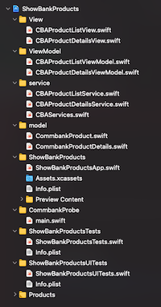

# Easter Holiday 2021 Code Challenge

## Introduction

This is a code-challenge I participated during Easter Holiday 2021. It demonstrates Mobile Application development capability.

## What you will need

- A Mac with Mac OS 11.2.3 with at least 16 GB of RAM

- Xcode 12.4

- iOS Simulators with at least iOS 14.4

- Git source code management 

### Setup Instructions

- Git clone from this git repo

- Change directory to `easter-2021-challenge/src`

- Use `Xcode` to open the project file: `ShowBankProducts.xcodeproj`

- Select `ShowBankProducts` target

- Select a simulator of your choice, i.e. `iPhone 12 Pro`

- Select `Build` (or CMD-b) from Xcode's Product menu

- Select `Run` (or CMD-r) to deploy the app and run on the selected simulator

- Select `Test` (or CMD-u) to execute all unit tests and test automation

## Features and Technologies

| Features | Technologies |
|----------|--------------|
| - Utilises Commonwealth Bank's Public Banking API | - iOS 14.4 |
| - Retrieve CBA Product List | - Swift 5.4 |
| - Display details of selected Product | - Swift UI |
| - Auto Layout w/ Multiple iOS Devices | - Combine Framework |
| - Support both Portrait/Landscape modes | - Unit Test with XCTest |
| - Support Accessibility Scalable Text Sizes | - UI Automation Test with XCUITest |
| - Simple Error Handling | - Model-View-ViewModel (MVVM) Design Pattern |
| | - Test Coverage |

## Code Organisation

This application was designed and developed using MVVM Design Pattern. Its souce codes are organised as below.

- Service Layer
    - CBAProductListService.swift
        - Communicate with CBA's remote service to retrieve products listing

    - CBAProductDetailsService.swift
        - Communicate with CBA's remote service to retrieve products' details

- Model
    - CommbankProduct.swift
        - Provide ability to serialise/deserialise objects for product listing

    - CommbankProductDetails.swift
        - Provide ability to serialise/deserialise objects for products' details

- View-Model
    - CBAProductListViewModel.swift
        - Provide view-model for product-listing page

    - CBAProductDetailsViewModel.swift
        - Provide view-model for product's details page

- View
    - CBAProductListView.swift
        - A SwiftUI implementation for products listing page
    
    - CBAProductDetailsView.swift
        - A SwiftUI implementation for product details page

## Testing and Code-Coverage

## References

1. [Commonwealth Bank's Public Banking API](https://www.commbank.com.au/developer/documentation/Products)

2. [Quicktype.io for quickly generate models from JSON data](https://quicktype.io)

## Thank you
